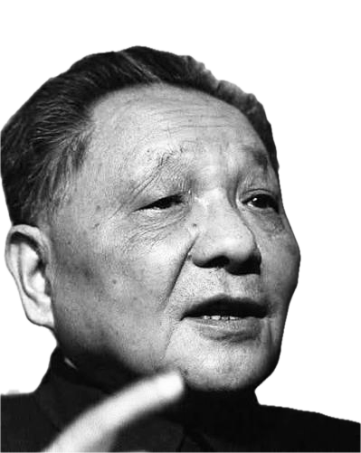
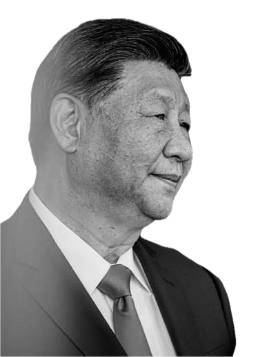
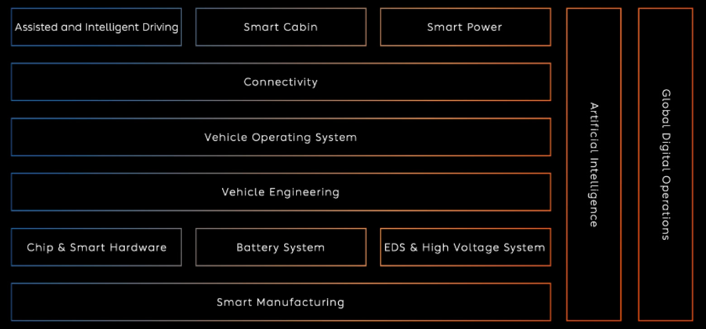
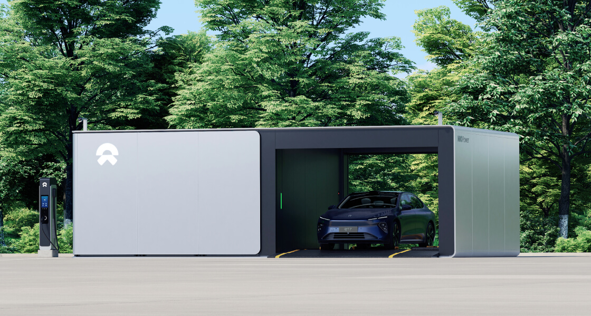
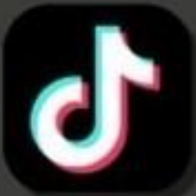
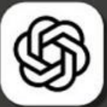
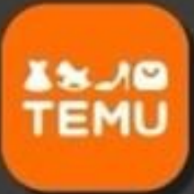
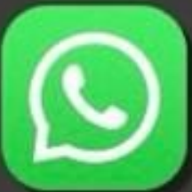

<!-- .slide: data-chapter="序|Opening" data-media="media/01-shanghai-night.mp4|media/01-shanghai-night.jpg" data-mood="red" -->

变

China Immersion · Team Briefing · 2026

<h1>From Copy to Copied</h1>

How China rewrote the rules of doing business, and what it means for <em>our customer</em> and <em>our business</em>.

IA

Igor Araujo

Speaker

Note:
**Mensagem:** isto não é um relato de viagem. É sobre uma virada: a China deixou de ser o país que copia e virou o país que todo mundo copia.

- Apresentar-se: Igor Araujo.
- Dar as boas-vindas e enquadrar: a grande lição não é um produto, é um jeito diferente de fazer negócio.
- Mostrar o caminho da conversa: a China de antes e a de hoje, a mudança de mentalidade e o jeito chinês de fazer negócio.
- Deixar claro o foco da conversa: o que isso significa para o nosso cliente e para o nosso negócio.
- Antecipar o fim: o desafio para nós, que é a venda pelas redes sociais, as lojas em transmissão ao vivo e como reconhecemos o nosso cliente.

---

<!-- .slide: data-media="media/02-beijing-street.mp4|media/02-beijing-street.jpg" -->

悟

The premise

“We came to China to understand ourselves.”

Our take on the line that opened the immersion: “we come to China to understand Brazil”

<h3>Rule #1 of the trip inside joke</h3>
Never come to China alone. <strong>Nobody will believe you</strong> when you get back and start telling what you saw.

Immersion, Sep 2026 · opening line and joke by Fábio Neto

Note:
**Mensagem:** fomos à China para entender a nós mesmos: o nosso cliente e o nosso negócio. Olhar para a China é olhar para o nosso futuro próximo.

- A imersão abriu com a frase "a gente vem para a China para entender o Brasil". A nossa releitura vai um passo além: viemos entender a nós mesmos.
- A China é o nosso maior parceiro comercial desde 2009.
- Os aplicativos, os carros e os modelos de negócio que vimos lá já estão chegando aqui.
- ▶ **Clique:** quebrar o gelo com a piada interna da viagem: "nunca venha à China sozinho, porque ninguém vai acreditar quando você voltar e começar a contar o que viu". É a deixa para o que vem a seguir: os números parecem inacreditáveis, mas são reais.

#### Siglas e abreviações na tela

- **Sep**: abreviação de *September*, setembro.
- **#1**: número um, a primeira regra.

---

<!-- .slide: data-chapter="一|Then and Now" data-media="media/03-china-1980s.jpg" data-mood="ink" -->

昔

China before vs China today

<h2>From one of the poorest to the second-largest economy</h2>

1978

$156

GDP per capita / year 134th of 167 countries · Brazil ≈ $2,100

→

2024

$13.3k

GDP per capita <strong>+85×</strong> (India ~14×, US ~8×, Brazil ~5×)

Sources: China Xperience deck (StartSe), slides 30–45 · ~90% in extreme poverty in 1978; extreme poverty officially eradicated in 2020

Note:
**Mensagem:** nenhuma grande economia fez algo parecido no mesmo período. Este é o ponto de partida para tudo o que vem depois.

- Em 1978, o chinês médio ganhava 156 dólares por ano, menos de um décimo do que ganhava um brasileiro. A China era o 134º de 167 países.
- Cerca de 90% da população vivia na pobreza extrema. Em 2020, a pobreza extrema foi declarada oficialmente erradicada.
- Hoje são 13,3 mil dólares por pessoa, oitenta e cinco vezes mais. Na mesma comparação, a Índia cresceu cerca de 14 vezes, os Estados Unidos cerca de 8 e o Brasil cerca de 5.
- Guardar esta proporção: ela é a base de tudo o que vem a seguir.

#### Siglas e abreviações na tela

- **GDP per capita** (*Gross Domestic Product*): produto interno bruto por pessoa.
- **US** (*United States*): Estados Unidos.
- **$**: dólar americano. **k**: mil (13.3k = 13,3 mil).

---

<!-- .slide: data-media="media/04-shenzhen-today.mp4|media/04-shenzhen-today.jpg" data-mood="neon" -->

速

What we saw · 2013 → 2025

<h2>Gradually… then suddenly</h2>

96<small>%</small>

use mobile payment (2024)

was 8% in 2013

15.9<small> tn RMB</small>

online retail

was 1.9 tn

199<small> bn</small>

parcels delivered

was 9.2 bn

50.4<small>k km</small>

high-speed rail

was 11k km

16.49<small> M</small>

electric vehicles

was 17,642

1<small> day</small>

heavy pollution in Beijing

was 58 days

−96<small>%</small>

recorded robberies (2024)

146,193 → 5,524

5.5<small>G</small>

mobile network + 6G tests

was 3G

Source: China Xperience deck (StartSe), “the transformations I saw”. Figures as shown; validate before external use

Note:
**Mensagem:** a mudança na China não é linear. Ela se acumula em silêncio e depois vira de uma vez.

- O líder da viagem morou em Xangai em 2013 e voltou para comparar.
- Em doze anos, o pagamento pelo celular foi de 8% para 96% da população. As encomendas entregues foram de 9 para 199 bilhões por ano.
- Os carros elétricos foram de cerca de 17 mil para 16 milhões e meio. Pequim passou de 58 dias de poluição pesada para um.
- Os roubos registrados caíram 96%. A rede de celular saiu da terceira geração e já está na "cinco e meia", com testes da sexta.
- Atenção: são os números como foram mostrados na imersão. Validar antes de usar fora da equipe.

#### Siglas e abreviações na tela

- **tn RMB**: trilhões de renminbi. O **RMB** (*Renminbi*, "moeda do povo") é a moeda chinesa, cuja unidade é o yuan.
- **bn** (*billion*): bilhões. **M**: milhões. **k km**: mil quilômetros.
- **5.5G, 6G, 3G**: o **G** quer dizer "geração" da rede de telefonia celular.

---

<!-- .slide: data-media="media/05-port-containers.mp4|media/05-port-containers.jpg" -->

量

17% of the world's people

<h2>…and the factory of the future</h2>

China's share of the world total

Li-ion battery capacity

&gt;80%

Solar module output

~80%

AI patents (2023)

69.7%

Global ship order book

66.8%

EV sales (2025)

~60%

New industrial robot installs

54%

Manufacturing output (2024)

32%

China's share of world totals, 2023–2026 · China Xperience deck (StartSe), slides 54–63 · AI patents: WIPO (US: 14.2%); most Chinese AI patents are protected only inside China

电

One more thing · Energy

<h2>More electricity than the US, EU and India combined</h2>

China (2024)

~10.1k

United States

4.4k

Terawatt-hours generated in 2024

“The real competition is about the power computing and <strong>electricity generation</strong>.” field view

China Xperience deck (StartSe) · quote: consultant speaking at the immersion, Sep 2026

Note:
**Mensagem:** isto não é mão de obra barata. A China domina as indústrias do futuro, e a energia que vai movê-las.

- Com 17% da população do mundo, a China tem cerca de um terço da produção industrial mundial (32% em 2024).
- Todas as barras são a participação da China no total do mundo, mas cada uma mede uma coisa:
  - baterias de íon de lítio: mais de 80% da capacidade de produção mundial;
  - módulos solares: cerca de 80% da produção mundial;
  - patentes de inteligência artificial: 69,7% do mundo em 2023, contra 13,4% antes e 14,2% dos Estados Unidos;
  - navios: 66,8% da carteira mundial de encomendas;
  - carros elétricos: cerca de 60% das vendas mundiais em 2025;
  - robôs industriais: 54% das novas instalações no mundo.
- Ela domina as indústrias da transição energética: baterias, painéis solares e carros elétricos.
- Se perguntarem sobre patentes: a própria fonte avisa que a maioria das patentes chinesas de inteligência artificial é protegida só dentro da China.
- ▶ **Clique (revelação final):** um detalhe que impressiona. Em 2024, a China gerou mais eletricidade do que Estados Unidos, União Europeia e Índia somados: cerca de 10,1 mil terawatts-hora, contra 4,4 mil dos Estados Unidos.
- Fechar com a frase da consultora que falou na imersão: "a competição real é poder computacional e geração de energia". Por trás da inteligência artificial, quem tem energia tem vantagem.

#### Siglas e abreviações na tela

- **Li-ion** (*lithium-ion*): baterias de íon de lítio.
- **AI** (*Artificial Intelligence*): inteligência artificial.
- **EV** (*Electric Vehicle*): veículo elétrico.
- **WIPO** (*World Intellectual Property Organization*): Organização Mundial da Propriedade Intelectual.
- **US** (*United States*): Estados Unidos. **EU** (*European Union*): União Europeia.
- **k**: mil (10.1k = 10,1 mil). Os números da revelação estão em terawatts-hora: um terawatt-hora é um bilhão de quilowatts-hora.
- **Sep**: setembro.

---

<!-- .slide: data-media="media/06-forbidden-city.jpg|media/06-great-wall.mp4" data-mood="ink" -->

回

The Chinese reading

<h2>A comeback, not a miracle</h2>

<strong>~30–35%</strong> of world GDP between 1500 and 1820.

Then the <strong>Century of Humiliation</strong> (1839–1949): Opium Wars, unequal treaties, invasion.

“A centuries-old company that just had a bad semester.”

Field view, Beijing

China Xperience deck (StartSe) · field notes, Sep 2026 · lessons that still drive priorities: sovereignty, strategic autonomy, stability

Note:
**Mensagem:** para os chineses, não é milagre, é retorno. Isso explica a paciência e o horizonte longo.

- Entre 1500 e 1820, a China era cerca de 30 a 35% da economia mundial.
- Depois veio o Século da Humilhação, de 1839 a 1949: Guerras do Ópio, tratados desiguais e invasão.
- A ascensão é lida como recuperar o que foi perdido. Essas lições ainda guiam as prioridades: soberania, autonomia estratégica e estabilidade.
- ▶ **Clique:** a frase que ouvimos em Pequim resume tudo: "uma empresa centenária que só teve um semestre ruim".
- Ligar com o próximo capítulo: é daí que vem o jogo de longo prazo.

#### Siglas e abreviações na tela

- **GDP** (*Gross Domestic Product*): produto interno bruto.
- *Field view* (etiqueta): visão de campo, uma opinião ouvida na imersão.

---

<!-- .slide: data-chapter="二|Mindset" data-media="media/07-weiqi-board.jpg|media/07-weiqi-board.mp4" data-mood="ink" data-opacity="0.8" -->

Mindset shift

<h2 style="margin-bottom:.1em">Chess vs Weiqi 围棋</h2>

Behind the text: a Weiqi board, the Chinese strategy game known in the West as <em>Go</em>

<h3 class="muted" style="font-size:30px">The West · confront and capture</h3>

Problem

Decision

Action

Result

<h3 class="gold fragment rise" style="font-size:30px;margin-top:36px">China · position and accumulate</h3>

Position

Balance of forces

Patience

Accumulated advantage

Result

EVs: <em>learn → localize → build capability → scale → compete globally</em>. Same playbook for Brazil.

China Xperience deck (StartSe), slides 47–53

Note:
**Mensagem:** o Ocidente joga xadrez; a China joga Weiqi. Ela ganha território aos poucos, com posição e paciência.

- Apontar a imagem do fundo: é um tabuleiro de Weiqi, o jogo de estratégia chinês que no Ocidente se chama Go. Pedras pretas e brancas sobre uma grade; não existe rei para derrubar, ganha quem cerca mais território.
- No xadrez, o objetivo é o xeque-mate: problema, decisão, ação, resultado.
- ▶ **Clique:** no Weiqi, que aqui conhecemos como Go, todas as pedras são iguais e vence quem acumula território.
- ▶ **Clique:** a sequência chinesa é posição, equilíbrio de forças, paciência, vantagem acumulada e só então o resultado.
- ▶ **Clique:** foi assim que a China entrou na indústria automotiva. Os carros elétricos anularam a vantagem que o Ocidente tinha nos motores a combustão. A China se associou a montadoras estrangeiras, aprendeu, localizou e construiu a cadeia inteira: baterias, minerais e programas. A participação de mercado veio como consequência.
- O mesmo roteiro está rodando agora no Brasil.

#### Siglas e abreviações na tela

- **EVs** (*Electric Vehicles*): veículos elétricos.
- **vs**: versus.

---

<!-- .slide: data-mood="red" data-media="media/08-ink-mountains.jpg" -->

From discretion to protagonism

韬光养晦

“Hide your strength, bide your time” Deng Xiaoping · open, learn, grow, avoid early confrontation

奋发有为

“Strive and take the initiative” Xi Jinping · technology, standards, capital, global presence

China Xperience deck (StartSe), slides 47–53

Note:
**Mensagem:** é o ponto de virada numa imagem só: da discrição ao protagonismo. É aqui que "copiar" vira "ser copiado".

- Ao fundo, as fotos dos dois líderes que marcaram essas fases: Deng Xiaoping, à esquerda, e Xi Jinping, que aparece no clique.
- O primeiro lema, de Deng Xiaoping: "esconder a força e esperar a hora". Abrir, aprender, crescer e evitar o confronto antes do tempo.
- ▶ **Clique:** o segundo, de Xi Jinping: "esforçar-se e tomar a iniciativa". Tecnologia, padrões, capital e presença global.
- Hoje a China define padrões e exporta tecnologia e modelos de negócio.

---

<!-- .slide: data-media="media/09-great-hall.jpg" -->

绩

Pragmatism, measured

“It doesn't matter if the cat is black or white, as long as it catches the mouse.”

Deng Xiaoping

Direction

KPIs

Projects

Incentives

Deliveries

Five-Year Plans: <strong>the KPI becomes the result</strong>.

Notes on the Five-Year Plans · China Xperience deck (StartSe)

Note:
**Mensagem:** pragmatismo com régua. A ideologia importa menos que o resultado.

- A frase de Deng Xiaoping: "não importa se o gato é preto ou branco, desde que pegue o rato".
- Os Planos Quinquenais transformam uma direção em indicadores públicos e mensuráveis, e províncias e empresas executam.
- A sequência na tela é direção, indicadores, projetos, incentivos e entregas: o indicador vira o resultado.
- É visão de longo prazo com cobrança de curto prazo, algo raro no Ocidente.

#### Siglas e abreviações na tela

- **KPIs** (*Key Performance Indicators*): indicadores-chave de desempenho.

---

<!-- .slide: data-mood="red" -->

规

15th Five-Year Plan · 2026–2030

<h2>The plan, in numbers</h2>

8 binding targets for 2030 · below each, today's baseline

1 · Education

11.7 <small>yrs</small>

of schooling · today 11.3

2 · Grain output

725 <small>Mt</small>

today 714.88 Mt

3 · Energy security

5.8 <small>bn tce</small>

today 5.13 bn tce

4 · Decarbonization

−17% <small>CO₂</small>

per unit of GDP

5 · Air quality

&lt;27 <small>µg/m³</small>

PM2.5

6 · Water quality

85<small>%</small>

Class III or better

7 · Forest cover

25.8<small>%</small>

today 25.1%

8 · Non-fossil energy

25<small>%</small>

today 21.7%

<ul class="pill-list" style="margin-top:30px">
<li class="fragment rise"><strong>8 binding + 20 indicative</strong> targets, all public. Execution is decentralized, province by province.</li>
<li class="fragment rise">The order reveals the priorities: <em>education and food first</em>, frontier tech after field view</li>
</ul>

15th Five-Year Plan of China (2026–2030), official document · via China Xperience deck (StartSe) · field notes, Sep 2026

Note:
**Mensagem:** o plano não é discurso, é planilha pública. Oito metas obrigatórias, com número e prazo.

- O 15º Plano Quinquenal vai de 2026 a 2030. Na tela, as oito metas vinculantes (obrigatórias) para 2030 e, embaixo de cada uma, a base atual.
  - Educação: 11,7 anos de escolaridade média (hoje 11,3).
  - Produção de grãos: 725 milhões de toneladas (hoje 714,88).
  - Segurança energética: 5,8 bilhões de toneladas equivalentes de carvão (hoje 5,13).
  - Descarbonização: 17% menos gás carbônico por unidade de produto interno bruto.
  - Qualidade do ar: menos de 27 microgramas de partículas finas por metro cúbico.
  - Qualidade da água: 85% das águas na classe III ou melhor.
  - Cobertura florestal: 25,8% (hoje 25,1%).
  - Energia não fóssil: 25% da matriz (hoje 21,7%).
- ▶ **Clique:** são 8 metas vinculantes e 20 indicativas, todas públicas, mas sem detalhe de como executar. A execução é descentralizada: cada província e cada prefeito corre atrás da meta.
- ▶ **Clique:** a ordem revela as prioridades. Educação e comida vêm primeiro, tecnologia de fronteira depois (leitura do Fábio Neto). Ponte para o próximo slide: onde o plano aposta em tecnologia.

#### Siglas e abreviações na tela

- **yrs** (*years*): anos.
- **Mt** (*megatonnes*): milhões de toneladas.
- **bn** (*billion*): bilhões.
- **tce** (*tonnes of coal equivalent*): toneladas equivalentes de carvão, unidade de energia.
- **CO₂**: gás carbônico (dióxido de carbono).
- **GDP** (*Gross Domestic Product*): produto interno bruto.
- **µg/m³**: microgramas por metro cúbico.
- **PM2.5** (*particulate matter*): partículas finas no ar, com menos de 2,5 micrômetros.
- **Class III**: faixa de qualidade da água na classificação chinesa (da classe I, a melhor, à V).
- **Field view**: visão de campo, opinião ouvida na imersão.
- **Sep**: setembro.

---

<!-- .slide: data-mood="red" -->

策

15th Five-Year Plan · priority technologies

<h2>Where the plan bets</h2>

<h3>Digital &amp; intelligent</h3><ul class="pill-list tight"><li>AI applied to industry and the real economy</li><li>Robotics and embodied AI</li><li>Semiconductors</li><li>6G</li><li>Brain-computer interface</li><li>Quantum technology</li></ul>

<h3>Advanced industry</h3><ul class="pill-list tight"><li>Smart electric vehicles</li><li>Advanced manufacturing</li><li>Industrial upgrade with AI + 5G</li><li>Biomanufacturing</li></ul>

<h3>Future energy &amp; new frontiers</h3><ul class="pill-list tight"><li>Hydrogen and future energy</li><li>Low-altitude economy</li><li>Aerospace and commercial space</li></ul>

“If robotics is the new smartphone, I'm going to dominate it.” field view

15th Five-Year Plan of China (2026–2030) · via China Xperience deck (StartSe) · field notes, Sep 2026

Note:
**Mensagem:** o plano diz em público onde a China vai ganhar. Quem lê a lista sabe onde a competição vai apertar.

- **Tecnologias digitais e inteligentes:** inteligência artificial aplicada à indústria e à economia real, robótica e inteligência artificial embarcada em máquinas, semicondutores, sexta geração de telefonia móvel, interface cérebro-computador e tecnologia quântica.
- ▶ **Clique:** **indústria e manufatura avançada:** carros elétricos inteligentes (a ponte com a NIO e a BYD), manufatura avançada, modernização da indústria com inteligência artificial e quinta geração de telefonia móvel, e biomanufatura.
- ▶ **Clique:** **energia do futuro e novas fronteiras:** hidrogênio, a "economia de baixa altitude" (drones e táxis aéreos) e espaço comercial.
- ▶ **Clique:** a leitura do Fábio Neto: "se robótica é o novo smartphone, eu vou dominar esse negócio". É o mesmo roteiro que a China fez com os carros elétricos.

#### Siglas e abreviações na tela

- **AI** (*Artificial Intelligence*): inteligência artificial.
- **Embodied AI**: inteligência artificial embarcada num corpo físico, como robôs.
- **6G** e **5G**: sexta e quinta gerações de telefonia móvel.
- **Low-altitude economy**: economia de baixa altitude, ou seja, drones de entrega e táxis aéreos.
- **Field view**: visão de campo, opinião ouvida na imersão.
- **Sep**: setembro.

---

<!-- .slide: data-chapter="三|Copy → Copied" data-media="media/10-factory-line.mp4|media/10-factory-line.jpg" -->

仿

The turning point

<h2>Three phases of China and innovation</h2>

<h3 class="muted">Made-in-China</h3>
<strong>1980–2000</strong> Factory of the world. Mass exports and the age of fakes (“Adidos”, “Hike”).

<h3>Copy-to-China</h3>
<strong>2000–2015</strong> Western models adapted locally: Baidu ≈ Google, Alibaba ≈ eBay/Amazon, QQ ≈ ICQ.

<h3 class="red">Copy-from-China</h3>
<strong>2015 → today</strong> China becomes the showcase: WeChat, Alipay and Pinduoduo are copied worldwide.

China Xperience deck (StartSe), slides 21–26

Note:
**Mensagem:** a seta inverteu. Desde cerca de 2015, é o Ocidente que copia a China.

- Primeira fase, de 1980 a 2000: a fábrica do mundo, incluindo as falsificações de que a gente ria, como "Adidos" e "Hike".
- ▶ **Clique:** segunda fase, de 2000 a 2015: modelos digitais ocidentais adaptados. O Baidu lembra o Google, o Alibaba lembra o eBay e a Amazon, e o QQ copiou literalmente o ICQ.
- ▶ **Clique:** terceira fase, de 2015 até hoje: a China vira vitrine. WeChat, Alipay e Pinduoduo são copiados no mundo todo. Superaplicativos, pagamento pelo celular e comércio social viraram referência.

#### Siglas e nomes na tela

- **QQ**: nome do aplicativo de mensagens chinês. É marca, não sigla.
- **ICQ**: aplicativo de mensagens dos anos 1990. O nome brinca com o som de *I seek you*, "eu procuro você".

---

<!-- .slide: data-media="media/11-ev-robots.mp4|media/11-ev-robots.jpg" data-mood="neon" -->

新

What China exports

<h2>Old 3 → New 3 → New-New 3</h2>

<h3 class="muted">Old 3</h3>
Clothing · Furniture · Home appliances mass exports

<h3>New 3</h3>
Electric vehicles · Lithium batteries · Solar panels global recognition

<h3 class="neon">New-New 3</h3>
Robotics · AI · Innovative drugs the new tech showcase

2025: <strong>95%</strong> of humanoid robots delivered worldwide were Chinese.

China Xperience deck (StartSe)

Note:
**Mensagem:** a pauta de exportação conta a história: de roupas e móveis para robôs, inteligência artificial e remédios inovadores.

- Os "três antigos": roupas, móveis e eletrodomésticos, ou seja, exportação em massa.
- ▶ **Clique:** os "três novos": carros elétricos, baterias de lítio e painéis solares, com reconhecimento global.
- ▶ **Clique:** os "três novíssimos": robótica, inteligência artificial e remédios inovadores, a nova vitrine tecnológica.
- ▶ **Clique:** em 2025, 95% dos robôs humanoides entregues no mundo eram chineses.

#### Siglas e abreviações na tela

- **AI** (*Artificial Intelligence*): inteligência artificial.
- **Old 3, New 3, New-New 3**: os três antigos, os três novos e os três novíssimos.

---

<!-- .slide: data-media="media/12-huaqiangbei.jpg|media/12-huaqiangbei.mp4" -->

模

The real advantage

“Silicon Valley invents. China turns it into a business model, at scale.”

<strong>Japan → Korea → China</strong>: cars, then electronics, then culture. Same playbook, bigger scale.

<strong>27</strong> Chinese car brands and <strong>9</strong> electronics brands in Brazil reported

Field notes, China immersion, Sep 2026

Note:
**Mensagem:** a vantagem real da China não é inventar. É transformar a invenção em modelo de negócio, em escala.

- Um ponto dos líderes da viagem: a invenção ainda é, em grande parte, americana. "O Vale do Silício inventa."
- O que a China faz melhor é adaptar rápido, transformar em negócio e escalar.
- Japão e Coreia fizeram o mesmo roteiro: carros, depois eletrônicos, depois cultura. A China faz em outra escala: 27 marcas de carro e 9 de eletrônicos no Brasil, contra duas ou três de cada um deles.

#### Siglas e abreviações na tela

- *Reported* (etiqueta): relato oral ouvido na viagem, não verificado de forma independente.

---

<!-- .slide: data-media="media/13-shanghai-traffic.mp4|media/13-shanghai-traffic.jpg" -->

The Business Model Kingdom

<h2>Not one app. An ecosystem.</h2>

<b>C2M</b>Customer to Manufacturer · Xiaomi

<b>OMO</b>Online Merge Offline · Hema

<b>FM</b>Fission Marketing · Pinduoduo

<b>F2CE</b>Factory to Consumer · Pinduoduo

<b>B2B2C</b>Alibaba.com

<b>B2E</b>Business to Employee · Lark

<b>B2G</b>Business to Gov · Huawei

<b>F2T</b>Farm to Table · Duoduo Maicai

<b>F2R</b>Farm to Restaurant · Meicai

<b>CGB</b>Community Group Buy

<b>LS</b>LiveShop · Taobao

<b>GP</b>Group Purchase · Meituan

“The biggest asset is no longer the factory.” — field view

Fábio Neto's opening · China Xperience deck (StartSe) · field notes

Note:
**Mensagem:** a China não tem um aplicativo, tem um ecossistema. E criou um vocabulário próprio de modelos de negócio.

- A maioria desses modelos mistura varejo, logística, pagamento e rede social.
- Destacar a sigla **LS**, de loja ao vivo: vamos voltar a ela na parte do desafio.
- ▶ **Clique:** "o maior ativo já não é a fábrica". O fio condutor é o ecossistema, não o aplicativo isolado.

#### Siglas na tela (todas do inglês)

- **C2M** (*Customer to Manufacturer*): do cliente para o fabricante. Exemplo: Xiaomi.
- **OMO** (*Online Merge Offline*): fusão da loja digital com a loja física. Exemplo: Hema.
- **FM** (*Fission Marketing*): marketing de "fissão", em que cada cliente traz novos clientes. Exemplo: Pinduoduo.
- **F2CE** (*Factory to Consumer*): da fábrica direto para o consumidor. Exemplo: Pinduoduo.
- **B2B2C** (*Business to Business to Consumer*): de empresa para empresa e daí para o consumidor. Exemplo: Alibaba.com.
- **B2E** (*Business to Employee*): de empresa para os funcionários. Exemplo: Lark.
- **B2G** (*Business to Government*): de empresa para o governo; **Gov** é governo. Exemplo: Huawei.
- **F2T** (*Farm to Table*): da fazenda para a mesa. Exemplo: Duoduo Maicai.
- **F2R** (*Farm to Restaurant*): da fazenda para o restaurante. Exemplo: Meicai.
- **CGB** (*Community Group Buy*): compra coletiva entre vizinhos.
- **LS** (*LiveShop*): loja em transmissão ao vivo. Exemplo: Taobao.
- **GP** (*Group Purchase*): compra em grupo. Exemplo: Meituan.

---

<!-- .slide: data-chapter="四|The China Way" data-media="media/14-dragon-dance.mp4|media/14-dragon-dance.jpg" data-mood="red" -->

道

The core insight

<h2>It's not the product. It's the way of doing business.</h2>

<h3 class="gold">01</h3>
<strong>100% digital</strong>

<h3 class="gold">02</h3>
<strong>Relationship first</strong>

<h3 class="gold">03</h3>
<strong>Then the sale</strong>

<h3 class="gold">04</h3>
<strong>Start at scale, unafraid to fail</strong>

Synthesis of the immersion: our interpretation, with evidence on the next slides

Note:
**Mensagem:** este é o coração da apresentação. Não é o produto, é o jeito de fazer negócio.

- Se a equipe guardar uma coisa só, que seja esta: a China joga outro jogo.
- É a nossa síntese da imersão. As evidências vêm nos próximos slides.
- ▶ **Quatro cliques, uma regra por clique:**
  - 01: tudo é digital.
  - 02: o relacionamento vem antes da transação.
  - 03: a venda vem depois.
  - 04: começar em escala, sem medo de errar, e corrigir no caminho.
- Fechar: "vamos ver cada uma".

---

<!-- .slide: data-media="media/15-qr-payment.mp4|media/15-qr-payment.jpg" data-mood="neon" -->

数

01

<h2>100% digital</h2>

96<small>%</small>

use mobile payment

8% in 2013

1.07<small> bn</small>

internet users

99.8% via mobile

<ul class="pill-list">
<li class="fragment rise">Cash became a <strong>museum piece</strong>. QR codes are everywhere, even for street donations reported</li>
<li class="fragment rise">Alipay with big buttons for the elderly</li>
<li class="fragment rise">The edge isn't tech innovation. It's <strong>digital transformation</strong>: an elderly woman paying by QR</li>
</ul>

Notes on mobile payments and super apps · China Xperience deck (StartSe) · field notes

Note:
**Mensagem:** na China, o digital não é um canal, é o padrão. A vantagem não é inovação tecnológica, é transformação digital que chega a todo mundo.

- 96% pagam pelo celular; em 2013 eram 8%.
- São 1,07 bilhão de pessoas na internet, e 99,8% delas acessam pelo celular.
- ▶ **Clique:** o dinheiro em espécie virou peça de museu. Há código de pagamento em toda parte, até para doação na rua (relato da viagem).
- ▶ **Clique:** o Alipay tem uma versão com botões grandes para idosos.
- ▶ **Clique:** o que impressiona não é a tecnologia, que nós também temos. É o alcance: avós, ambulantes, todo mundo. A imagem é uma senhora idosa pagando com o celular. Isso é transformação, não inovação.

#### Siglas e abreviações na tela

- **QR** (*Quick Response*, "resposta rápida"): o código quadrado lido pela câmera do celular.
- **bn** (*billion*): bilhões.
- **Sep** (*September*): setembro.

---

<!-- .slide: data-media="media/16-tea-dinner.mp4|media/16-tea-dinner.jpg" data-mood="red" -->

关

02

<h2>Relationship first</h2>

<h3>关系 Guanxi</h3>
The relationship is worth more than the contract.

<h3>面子 Mianzi</h3>
Face. Thank, then congratulate, then ask.

<ul class="pill-list">
<li class="fragment rise">TikTok spent <strong>“seven years of small talk”</strong> (socializing and gamifying) before it started selling field view</li>
<li class="fragment rise">NIO: “a tech company that <em>happens to have</em> products, <em>happens to</em> provide services, <em>happens to have</em> a community”</li>
</ul>

Notes on Confucian values, strategic thinking, EVs · field notes, Sep 2026

NIO · the company behind the car

<figure><figcaption><b>The full stack, in-house</b>Chip, battery, OS, driving, cabin. AI runs through all of it.</figcaption></figure>
<figure><figcaption><b>Swap, don't charge</b><strong class="gold">~5 min</strong> from arrival to departure. And a new business model: <strong class="gold">BaaS</strong>, Battery as a Service. field view</figcaption></figure>

NIO official website (Innovation · NIO Power) · company's own description

NIO · the car has a face

<h2>Meet NOMI</h2>

An AI companion on the dashboard. It smiles, it looks around, it has a face. The relationship is <em>built into the car</em>.

NIO official website · company's own description

<video src="media/16-nio-nomi.mp4" autoplay muted loop playsinline></video>

Note:
**Mensagem:** o relacionamento é o ativo, e a venda nasce dele.

- **Guanxi** (关系): a rede de confiança. O relacionamento vale mais que o contrato.
- **Mianzi** (面子): "dar face", preservar a imagem do outro. A ordem é agradecer, depois parabenizar e só então pedir.
- ▶ **Clique:** as plataformas funcionam igual. O TikTok passou "sete anos de conversa fiada", socializando e transformando tudo em jogo, antes de começar a vender (visão de campo).
- ▶ **Clique:** a NIO se descreve como "uma empresa de tecnologia que, por acaso, tem produtos, por acaso presta serviços e por acaso tem uma comunidade". A comunidade vem primeiro.
- ▶ **Clique (tela cheia):** "a empresa por trás do carro", com imagens do próprio site da NIO, para puxar a conversa.
  - **Pilha completa, feita em casa:** chip, bateria, sistema operacional, condução assistida e cabine, com inteligência artificial e operação digital atravessando todas as camadas. O carro é a ponta de uma empresa de tecnologia.
  - **Trocar, não recarregar:** na estação NIO Power o carro entra e troca a bateria em vez de esperar a recarga. São uns 5 minutos no total, da chegada à saída (visão de campo).
  - Isso abre um modelo de negócio: a bateria como serviço. O cliente compra o carro sem a bateria e paga por ela como assinatura. É serviço e relacionamento contínuo, não venda única.
  - Ponte com a mensagem do slide: produto, serviço e comunidade num ecossistema só. É a autodescrição da empresa, então apresente como "é assim que a NIO se vende".
- ▶ **Clique (tela cheia, vídeo):** o NOMI, assistente de inteligência artificial da NIO, uma pequena esfera com "rosto" sobre o painel. Ele sorri e olha ao redor: o assistente ganha um rosto.
  - Mensagem: o carro tem personalidade. O relacionamento está embutido no produto, não só no pós-venda. É a ponte direta para a "rede de relacionamento" do fechamento.

#### Siglas e nomes na tela

- **NIO**: montadora chinesa de carros elétricos. É nome de marca, não sigla.
- **NIO Power**: a rede de recarga e de troca de bateria da NIO.
- **NOMI**: nome do assistente de bordo da NIO. É nome próprio, não sigla.
- **OS**: sistema operacional (do inglês *operating system*).
- **AI**: inteligência artificial.
- **In-house**: feito dentro da própria empresa.
- **Swap**: troca (aqui, troca da bateria).
- **min**: minutos.
- **BaaS** (*Battery as a Service*): bateria como serviço, ou seja, a bateria por assinatura em vez de comprada junto com o carro.
- **Field view**: visão de campo, relato nosso, não dado de fonte.

---

<!-- .slide: data-media="media/17-livestream-studio.mp4|media/17-livestream-studio.jpg" data-mood="neon" -->

商

03

<h2>Then the sale</h2>

Discover commerce: <strong>the product finds the customer</strong>. Average pages until you find a product:

Mercado Livre

8.7

Shopee

7.3

OLX

5.8

Temu

2.2

TikTok

1.2

Trust moves <strong>from the brand to the channel</strong>: “I buy on TikTok because I know it will arrive.”

Figures cited from Fábio Neto's book (reported) · notes on social and live commerce

Note:
**Mensagem:** depois do relacionamento vem a venda, e ela nem parece venda. O produto encontra o cliente.

- É o "comércio de descoberta": o algoritmo leva o produto até a pessoa, no meio do entretenimento.
- Média de páginas até achar um produto: no Mercado Livre são 8,7; na Shopee, 7,3; na OLX, 5,8. Na Temu são 2,2 e no TikTok, 1,2.
- Esses números são citados do livro do Fábio Neto (relato).
- ▶ **Clique:** a confiança migra da marca para o canal: "compro no TikTok porque sei que vai chegar".

#### Siglas e nomes na tela

- **OLX**: plataforma de classificados. O nome vem de *OnLine eXchange*, "troca pela internet".

---

<!-- .slide: data-media="media/18-drone-show.mp4|media/18-drone-show.jpg" -->

大

04

<h2>Start at scale. Fix later.</h2>

The West

Test

Validate

Scale

China

Scale

Learn

Fix

<ul class="pill-list" style="margin-top:30px">
<li class="fragment rise">“The Chinese philosophy is scale, then fix” field view</li>
<li class="fragment rise">Entering Brazil means taking punches until it works: 99 Food left, then came back with a <strong class="gold">US$&nbsp;2&nbsp;bn</strong> check; Keeta keeps going</li>
<li class="fragment rise">“Cheap Chinese” (<em>xing ling</em>) becomes acceptable over time</li>
</ul>

Notes on strategic thinking and implications for Brazil · field notes, Sep 2026

Note:
**Mensagem:** o medo de errar custa mais caro que o próprio erro.

- O nosso instinto é testar, validar e só depois escalar.
- ▶ **Clique:** o instinto chinês é o contrário: escalar, aprender e corrigir com o carro andando.
- ▶ **Clique:** "a filosofia chinesa é escalar e depois corrigir" (visão de campo).
- ▶ **Clique:** entrar no Brasil é apanhar até dar certo. O 99 Food apanhou, foi embora e manteve só o transporte de passageiros. Agora voltou com um cheque de 2 bilhões de dólares e está incomodando o iFood, segundo o Fábio. O Keeta, da Meituan, chegou a demitir a equipe do Rio de Janeiro e segue em frente. As marcas de carro também chegam em ondas.
- ▶ **Clique:** o "chinês barato" (*xing ling*) vai ficando aceitável com o tempo.

#### Siglas e abreviações na tela
- **US$**: dólares americanos.
- **bn** (*billion*): bilhões.

---

<!-- .slide: data-mood="red" -->

局

Four more rules for our relationship with China's growth

<h2>And beyond the four</h2>

<h3 class="gold">05</h3>
<strong>Ecosystem &gt; app.</strong> Many services in one journey, with internal traffic, lower expansion cost and more recurrence.

<h3 class="gold">06 棋</h3>
<strong>Long game, clear KPIs.</strong> Accumulate advantage like Weiqi and execute like a Five-Year Plan.

<h3 class="gold">07</h3>
<strong>Build, buy or partner.</strong> “What they can do, they do themselves. What they can't, they invest, acquire or partner.”

<h3 class="gold">08</h3>
<strong>Innovate = apply at scale.</strong> When Uber arrived, taxi drivers in Brazil set cars on fire. In China, they downloaded the app <em>the same day</em>.

Synthesis note “The Chinese way of doing business” · field notes, Sep 2026

Note:
**Mensagem:** além das quatro regras, há mais quatro que importam para a nossa relação com o crescimento da China.

- ▶ **Clique:** regra 05, o ecossistema vale mais que o aplicativo. Vários serviços numa jornada só, com tráfego interno, custo de expansão menor e mais recorrência.
- ▶ **Clique:** regra 06, jogo longo com indicadores claros. Acumular vantagem como no Weiqi e executar como num Plano Quinquenal. O ideograma ao lado do número é o do Weiqi, para lembrar o tabuleiro do início da apresentação.
- ▶ **Clique:** regra 07, construir, comprar ou fazer parceria. "O que conseguem fazer, fazem sozinhos. O que não conseguem, investem, compram ou se associam."
- ▶ **Clique:** regra 08, inovar é aplicar em escala. Quando a Uber chegou ao Brasil, foi guerra: taxistas agrediram motoristas e puseram fogo em carros. Quando a Uber entrou na China, os taxistas baixaram o aplicativo no mesmo dia, porque não precisariam mais rodar a cidade procurando passageiro. A diferença é a abertura a novos modelos de negócio, como contou o Vinícius.

#### Siglas e abreviações na tela

- **KPIs** (*Key Performance Indicators*): indicadores-chave de desempenho.
- **Ecosystem > app**: o ecossistema vale mais que o aplicativo.
- **Sep** (*September*): setembro.

---

<!-- .slide: data-chapter="五|The Challenge" data-media="media/19-phone-scroll.mp4|media/19-phone-scroll.jpg" data-mood="neon" -->

网

The challenge

<h2>Brazil is already Chinese</h2>

Most downloaded apps in Brazil, 2025 · ranking

1<b>TikTok</b><i>CN</i>

2<b>ChatGPT</b><i>US</i>

3<b>Temu</b><i>CN</i>

4<b>Instagram</b><i>US</i>

5<b>Gov.br</b><i>BR</i>

6<b>Mercado Livre</b><i>AR</i>

7<b>Nubank</b><i>BR</i>

8<b>Kwai</b><i>CN</i>

9<b>Shopee</b><i>SG</i>

10<b>WhatsApp</b><i>US</i>

134<small> M</small>

TikTok users in Brazil · more A/B reported

65<small> M</small>

Kwai users in Brazil · more C/D reported

TikTok Bank + Alipay

with financial licenses in Brazil reported

Most downloaded apps in Brazil, 2025 (Sensor Tower, as shown in the immersion deck) · field notes, Sep 2026

Note:
**Mensagem:** isto já não é uma história sobre a China. A relação com o nosso cliente já passa por plataformas chinesas.

- Na tela, os dez aplicativos mais baixados no Brasil em 2025, com os logotipos. Os chineses estão acesos; os demais, apagados.
- Dois dos três primeiros são chineses: o TikTok em primeiro e a Temu em terceiro. O Kwai aparece em oitavo. O segundo lugar é do ChatGPT, americano.
- O ranking é por posição; a fonte não informa o número de downloads de cada aplicativo.
- ▶ **Clique:** o TikTok tem 134 milhões de usuários no Brasil, mais nas classes A e B (relato).
- ▶ **Clique:** o Kwai tem 65 milhões, mais nas classes C e D. Juntos, alcançam todas as classes (relato).
- ▶ **Clique:** agora chegam também as licenças financeiras: TikTok Bank e Alipay no Brasil (relato).

#### Siglas e abreviações na tela

- **CN**: China. **US** (*United States*): Estados Unidos. **BR**: Brasil. **AR**: Argentina (Mercado Livre). **SG**: Singapura (Shopee). Indicam o país de origem de cada aplicativo.
- **Gov.br**: aplicativo de serviços do governo federal brasileiro.
- **ChatGPT**: o **GPT** vem de *Generative Pre-trained Transformer*, "transformador generativo pré-treinado", o tipo de modelo de inteligência artificial por trás do assistente.
- **M**: milhões (134M = 134 milhões).
- **A/B** e **C/D**: classes sociais por faixa de renda.

---

<!-- .slide: data-media="media/20-live-host.jpg" data-mood="neon" -->

播

Live shops · social selling

<h2>Entertainment is the new store</h2>

<video data-autoplay muted loop playsinline preload="auto" src="media/20-live-host.mp4" onloadeddata="this.parentNode.classList.add('ok')"></video>● LIVE

~1<small> tn ¥</small>

live commerce per year in China, ~30% of e-commerce

reported

¥872,986

one sneaker seller, one 4h30 live, 5.63% conversion

Hangzhou case, reported

670<small>k</small>

car deposits sold via TikTok Shop China (2025)

reported

#3

TikTok Shop's rank among Brazil's retailers, reached in 12 months (~20% from live)

reported

One perfume seller doing night lives on TikTok: <strong>R$2.5M/month</strong>, equal to <strong>69 stores</strong> of a major cosmetics chain reported

Notes on social and live commerce · field notes, Sep 2026 (oral reports, not independently verified)

Note:
**Mensagem:** o entretenimento é a nova loja. Mesmo sendo relatos orais, a direção é clara.

- Na China, o comércio em transmissão ao vivo movimenta perto de um trilhão de yuans por ano, cerca de 30% do comércio eletrônico.
- Um vendedor de tênis de Hangzhou fez quase 873 mil yuans numa única transmissão de quatro horas e meia, com 5,63% de conversão.
- Em 2025, 670 mil sinais de compra de carro foram vendidos pelo TikTok Shop na China.
- No Brasil, o TikTok Shop teria virado o terceiro maior varejista em doze meses, com cerca de 20% das vendas vindo das transmissões ao vivo.
- ▶ **Clique:** uma única pessoa vendendo perfume em transmissões noturnas no TikTok fatura 2,5 milhões de reais por mês, o mesmo que 69 lojas de uma grande rede de cosméticos.
- Reforçar: são relatos orais da viagem, não verificados de forma independente.

#### Siglas e abreviações na tela

- **tn ¥**: trilhões de yuans; **¥** é o símbolo do yuan.
- **4h30**: quatro horas e trinta minutos.
- **k**: mil (670k = 670 mil).
- **#3**: terceiro lugar.
- **R$2.5M/month**: 2,5 milhões de reais por mês.
- **LIVE** (selo no celular): ao vivo.

---

<!-- .slide: data-media="media/21-crowd-phones.jpg|media/21-crowd-phones.mp4" -->

隐

Why this hurts

<h2>The invisible sale</h2>

<h3>Decided there, billed here</h3>
The customer decides on Kwai or TikTok (a backhoe, a car, rural credit) and closes at the dealer. The channel <strong>never shows up</strong> in our metrics.

<h3>The platform owns the customer</h3>
Commission, ads and fees add up to <strong>30–35%</strong>. Stop paying and the traffic is gone. Brands get “held hostage” by the ecosystem.

<h3>Trust moves to the channel</h3>
“Branding is dying in China.” Performance and discounts replace pure branding.

Even “serious” B2B sells there: heavy machinery and rural credit have thousands of videos.

Field views from the immersion (consultant in China; trip leads) · notes on social commerce and super apps

Note:
**Mensagem:** a ameaça real não é só o produto mais barato. A decisão de compra migra para um lugar que não vemos e não controlamos.

- ▶ **Clique:** decidido lá, faturado aqui. O cliente decide no Kwai ou no TikTok (uma retroescavadeira, um carro, um crédito rural) e fecha na concessionária. O canal nunca aparece nas nossas métricas.
- ▶ **Clique:** a plataforma é dona do cliente. Comissão, anúncios e taxas somam de 30 a 35%. Parou de pagar, o tráfego some. As marcas ficam "sequestradas" pelo ecossistema.
- ▶ **Clique:** a confiança migra para o canal. "A marca está morrendo na China": desempenho e desconto substituem a construção de marca pura.
- ▶ **Clique:** até a venda entre empresas, a mais "séria", acontece lá. Máquinas pesadas e crédito rural têm milhares de vídeos.
- Fechar: a plataforma fica com os dados, com o relacionamento e com um terço da margem. Se não reconhecemos o cliente, não conquistamos o cliente.

#### Siglas e abreviações na tela

- **B2B** (*Business to Business*): venda de empresa para empresa.
- **ads** (*advertisements*): anúncios.

---

<!-- .slide: data-chapter="六|Future CRM" data-fx="network" data-mood="red" -->

识

How China recognizes the customer

<h2>One customer. Every context.</h2>

<ul class="pill-list sm">
<li class="fragment rise"><strong>The ecosystem sees it all:</strong> payment, delivery, mobility, content, commerce</li>
<li class="fragment rise"><strong>One CRM across services:</strong> a lot of fast food led the Alibaba health app to suggest a cholesterol test reported</li>
<li class="fragment rise"><strong>Score as relationship:</strong> Sesame Credit reads 8 behavioral factors and unlocks services with no deposit</li>
</ul>
<ul class="pill-list sm">
<li class="fragment rise"><strong>From symptom to medicine at your door:</strong> book, pay with insurance, see the doctor, get the results and the prescription. <em>10 steps, one app.</em></li>
<li class="fragment rise"><strong>AI that executes:</strong> Qwen plugged into Taobao, Alipay and Fliggy books, buys and pays</li>
</ul>

Notes on super apps and ecosystems · China Xperience deck (StartSe), slides 98–110 · field notes

Note:
**Mensagem:** um cliente, todos os contextos. O ecossistema chinês reconhece o cliente em toda parte, e o próximo passo acontece sem atrito.

- ▶ **Clique:** o ecossistema vê tudo: pagamento, entrega, mobilidade, conteúdo e compras.
- ▶ **Clique:** uma base única de relacionamento com o cliente, compartilhada entre serviços. Comer muito lanche rápido levou o aplicativo de saúde do Alibaba a sugerir um exame de colesterol (relato). É real e um pouco assustador.
- ▶ **Clique:** a pontuação como relacionamento. O Sesame Credit lê 8 fatores de comportamento e libera serviços sem depósito.
- ▶ **Clique:** a jornada completa do paciente num só aplicativo, em 10 passos: sintoma, busca do médico, agendamento, seguro (elegibilidade e pagamento), consulta presencial ou online, exames com resultado no celular, receita eletrônica, compra do remédio, entrega em casa e retorno online para quem tem doença crônica.
  - Mensagem: o paciente nunca sai do aplicativo, e cada passo gera um dado que alimenta o próximo. Compare com a nossa jornada: quantos aplicativos, ligações e papéis entre o sintoma e o remédio?
- ▶ **Clique:** inteligência artificial que executa. O Qwen, ligado ao Taobao, ao Alipay e ao Fliggy, reserva, compra e paga.
- Algumas dessas práticas nós nunca aceitaríamos. A lição é o reconhecimento do cliente em todos os contextos.

#### Siglas e nomes na tela

- **CRM** (*Customer Relationship Management*): gestão do relacionamento com o cliente. Aqui, uma base única de dados do cliente.
- **AI** (*Artificial Intelligence*): inteligência artificial.
- **Qwen**: nome do assistente de inteligência artificial do Alibaba. Não é sigla.

---

<!-- .slide: data-fx="network" data-mood="neon" -->

智

AI and the customer

<h2>Recommend vs execute</h2>

<h3 class="muted">The West</h3>
AI sits outside the ecosystem, depends on integrations and fragmented data. <strong>It recommends, but doesn't execute.</strong>

<h3 class="neon">China</h3>
AI is born inside the ecosystem, next to payment and commerce, and evolves into agents. <strong>The shortest distance to action.</strong>

“China was born inside the ecosystem. The advantage is structural.”

China Xperience deck (StartSe) · live Qwen demo during the immersion

Note:
**Mensagem:** a ideia-chave para o futuro da gestão do relacionamento com o cliente é encurtar a distância entre conhecer o cliente e atendê-lo.

- No Ocidente, a inteligência artificial fica fora do ecossistema e depende de integrações e de dados fragmentados. Ela recomenda, mas não executa.
- ▶ **Clique:** na China, ela nasce dentro do ecossistema, ao lado do pagamento e das compras, e evolui para agentes. É a menor distância até a ação.
- Na imersão vimos uma demonstração ao vivo: o assistente do Alibaba reservou viagem, hotel e táxi de ponta a ponta, porque o pagamento já está dentro dele. Os assistentes ocidentais recomendam e depois mandam você para outro lugar.
- ▶ **Clique:** "a China nasceu dentro do ecossistema. A vantagem é estrutural."

#### Siglas e abreviações na tela

- **AI** (*Artificial Intelligence*): inteligência artificial.
- **vs**: versus.

---

<!-- .slide: data-fx="network" data-mood="red" -->

Our view interpretation

<h2>The CRM of the future</h2>

From system of record → <strong>system of relationship &amp; action</strong>

<h3 class="gold">1</h3>
<strong>Recognize</strong> One customer identity that includes social and live signals, not just our own transactions.

<h3 class="gold">2</h3>
<strong>Relate before selling</strong> Content, community, creators and live sellers become part of the relationship operation.

<h3 class="gold">3</h3>
<strong>Capture the invisible sale</strong> Link the decision made on social to the sale closed in the store or at the counter.

<h3 class="gold">4</h3>
<strong>Act, don't just record</strong> Agents that run the journey and shorten the distance to action.

<h3 class="jade">5</h3>
<strong>Own the data, with trust</strong> Owned channels so we're not held hostage. Privacy as our edge.

Synthesis note “Recognizing the customer: data and the CRM of the future”: our interpretation of the immersion

Note:
**Mensagem:** esta é a nossa proposta, não um fato da China. A gestão do relacionamento com o cliente deixa de ser um sistema de registro e vira um sistema de relacionamento e ação.

- Ela precisa parar de ser um banco de dados do que já aconteceu e virar o motor do relacionamento.
- ▶ **Clique:** 1, reconhecer. Uma identidade única do cliente, que inclua os sinais das redes sociais e das transmissões ao vivo, e não só as nossas próprias transações.
- ▶ **Clique:** 2, relacionar antes de vender. Conteúdo, comunidade, criadores e vendedores ao vivo passam a fazer parte da operação de relacionamento.
- ▶ **Clique:** 3, capturar a venda invisível. Ligar a decisão tomada na rede social à venda fechada na loja ou no balcão.
- ▶ **Clique:** 4, agir, não só registrar. Agentes que conduzem a jornada e encurtam a distância até a ação.
- ▶ **Clique:** 5, ser dono do dado, com confiança. Canais próprios para não ficar refém da plataforma.
- A nossa vantagem sobre o modelo chinês pode ser a confiança e a privacidade, porque lá, como ouvimos, "não há privacidade de dados pessoais".

#### Siglas e termos na tela

- **CRM** (*Customer Relationship Management*): gestão do relacionamento com o cliente. O título diz "o futuro da gestão do relacionamento com o cliente".
- *System of record*: sistema de registro. *System of relationship & action*: sistema de relacionamento e ação.
- *Interpretation* (etiqueta): interpretação nossa, não um fato observado.

---

<!-- .slide: data-fx="network" data-mood="red" -->

桥

Our view interpretation

<h2 style="margin-bottom:0">From China to Salesforce</h2>

In ChinaSalesforce · the relationship network

1
<b>Recognize</b>One ecosystem sees the customer everywhere: too much fast food, and the health app suggests a cholesterol test.
→
<strong>Data 360</strong>: identity resolution turns followers, live viewers and site visitors into known profiles <em>before the first purchase</em>.

2
<b>Relate before selling</b>Trust moved from the brand to the channel. Live sellers and creators run the relationship.
→
<strong>Marketing Cloud + Loyalty</strong>: journeys triggered by a like, a comment or a live; reward engagement, not just purchase.

3
<b>Capture the invisible sale</b>They decide on Kwai or TikTok and close at the dealership. The channel disappears from the metrics.
→
<strong>Sales Cloud</strong>: the social signal becomes a lead for the seller in the store or the dealership, and the loop closes.

4
<b>Act, don't just record</b>AI is born next to payment and commerce: “the shortest distance to action”.
→
<strong>Agentforce</strong>: agents that talk to the not-yet-customer on WhatsApp and social, answer, qualify and book the visit.

5
<b>Own the data, with trust</b>Brands are “held hostage” by the platform (30–35% in fees), with no personal data privacy.
→
<strong>Consent in Data 360 + Trust Layer</strong>: our own relationship network, built on consent, instead of renting the platform's audience.

China built the relationship <em>into the platform</em>. We can build it <strong class="sf">into our ecosystem</strong>.

Synthesis note “Recognizing the customer: data and the CRM of the future”: our interpretation, connecting the immersion to Salesforce

Note:
**Mensagem:** o próximo cliente ainda não comprou. Ele já segue, comenta e assiste, e a gestão do relacionamento com o cliente precisa conhecê-lo antes da primeira compra. É aí que os nossos produtos entram.

- Este slide é a nossa leitura, não um fato da China. À esquerda, o que vimos lá; à direita, em azul, como os produtos da Salesforce ajudam a construir essa rede de relacionamento com quem ainda não é cliente.
- ▶ **Clique:** 1, reconhecer. Lá, o ecossistema vê a pessoa em todos os contextos. Para nós, o Data 360 resolve a identidade: seguidores, quem assiste às lives e quem visita o site viram perfis conhecidos antes da primeira compra.
- ▶ **Clique:** 2, relacionar antes de vender. Lá, o vendedor ao vivo e o criador conduzem a relação. Para nós, o Marketing Cloud dispara jornadas a partir de uma curtida, de um comentário ou de uma live, e o Loyalty recompensa o engajamento, não só a compra.
- ▶ **Clique:** 3, capturar a venda invisível. Lá, a decisão acontece no Kwai ou no TikTok e a venda fecha na concessionária. Para nós, o sinal da rede social vira uma oportunidade no Sales Cloud para o vendedor da loja ou da concessionária, e o ciclo se fecha.
- ▶ **Clique:** 4, agir, não só registrar. Lá, a inteligência artificial está ao lado do pagamento e do comércio. Para nós, os agentes do Agentforce conversam com quem ainda não é cliente no WhatsApp e nas redes, respondem, qualificam e agendam a visita.
- ▶ **Clique:** 5, ser dono do dado, com confiança. Lá, as marcas ficam reféns da plataforma, pagando de 30 a 35% em taxas, e não há privacidade. Para nós, o consentimento no Data 360 e a camada de confiança do Einstein permitem ter uma rede de relacionamento própria, construída com consentimento, em vez de alugar a audiência da plataforma.
- Fechar com a frase da tela: a China construiu o relacionamento dentro da plataforma; nós podemos construí-lo dentro do nosso ecossistema, com dados, marketing, vendas, agentes e confiança conectados.

#### Siglas e termos na tela

- **CRM** (*Customer Relationship Management*): gestão do relacionamento com o cliente.
- **AI** (*Artificial Intelligence*): inteligência artificial.
- **Data 360**: plataforma de dados da Salesforce que unifica o perfil do cliente (antigo Data Cloud). *Identity resolution*: resolução de identidade, juntar sinais de canais diferentes numa mesma pessoa.
- **Marketing Cloud**, **Sales Cloud**: produtos da Salesforce para marketing e para vendas. **Loyalty**: gestão de programas de fidelidade.
- *Lead*: contato com potencial de compra, ainda não convertido.
- **Trust Layer** (*Einstein Trust Layer*): camada de confiança da Salesforce que protege os dados usados pela inteligência artificial.
- **Agentforce**: plataforma de agentes de inteligência artificial da Salesforce.
- *Interpretation* (etiqueta): interpretação nossa, não um fato observado.
- 桥 (*qiáo*): "ponte", o ideograma ao fundo.

---

<!-- .slide: data-media="media/22-great-wall-sunrise.mp4|media/22-great-wall-sunrise.jpg" -->

行

From signals to action · the gaps we'll face

<h2>The problems ahead</h2>

H1

<strong>Now: native social integration.</strong> Customers already ask us to plug in Instagram, because that's where they relate to their customers. Salesforce can't absorb it natively today, and it isn't on any roadmap. field view

H2

<strong>Next: identity inside walled gardens.</strong> TikTok, Kwai and Instagram own the data. Matching social identity to our profile, with consent, and crediting lives, creators and affiliates for the sale. our view

H3

<strong>Later: the sale happens outside the CRM.</strong> AI agents buying end to end inside the platforms, and financial super apps (TikTok Bank, Alipay) closing the loop without us. our view

Horizons method from the closing workshop of the immersion · H1: what our customers are asking us today · H2–H3: our interpretation

Note:
**Mensagem:** se a relação com o cliente acontece nas redes sociais e nós não estamos lá, a gestão do relacionamento com o cliente fica de fora da conversa. Estes são os problemas que vamos enfrentar para olhar para esse mercado.

- Usamos o método dos Horizontes da oficina de encerramento da viagem, agora aplicado aos nossos problemas.
- ▶ **Clique:** Horizonte 1, o presente. É o problema de hoje: vários clientes já pedem integração com o Instagram, porque é lá que eles se relacionam com os clientes deles. A Salesforce não absorve isso de forma nativa e o tema não está em nenhum planejamento de produto. Isso é o que ouvimos dos nossos clientes, não uma fala da imersão.
- ▶ **Clique:** Horizonte 2, o provável. Os dados ficam presos dentro das plataformas: TikTok, Kwai e Instagram são donos do dado. O desafio será casar a identidade da pessoa na rede social com o nosso perfil, com consentimento, e atribuir a venda à transmissão ao vivo, ao criador ou ao afiliado. É a "venda invisível" do slide anterior.
- ▶ **Clique:** Horizonte 3, o possível. A venda pode acontecer inteira fora da gestão do relacionamento com o cliente: agentes de inteligência artificial comprando de ponta a ponta dentro das plataformas, e superaplicativos financeiros, como TikTok Bank e Alipay, fechando o ciclo sem passar por nós.
- Os horizontes 2 e 3 são leitura nossa; vale abrir para o time completar.

#### Siglas e abreviações na tela

- **H1, H2, H3**: Horizonte 1, Horizonte 2 e Horizonte 3.
- **CRM** (*Customer Relationship Management*): gestão do relacionamento com o cliente.
- **AI** (*Artificial Intelligence*): inteligência artificial.
- *Roadmap*: planejamento de produto. *Walled gardens*: "jardins murados", plataformas que retêm os dados dentro delas.
- *Field view* (etiqueta): visão de campo, o que ouvimos dos clientes. *Our view*: leitura nossa.

---

<!-- .slide: data-chapter="结|Closing" data-media="media/23-red-lanterns.mp4|media/23-red-lanterns.jpg" data-mood="red" -->

缘

Closing · our turn

We taught the world CRM in the cloud. Now let's teach it the relationship network.

Relationship first. Then the sale. At scale. <strong class="sf">With trust.</strong>

“Maybe this way of doing business is a rescue of our own identity.” field view

The rescue, for us

Put the R back in CRM.

From system of record to <strong class="sf">system of relationship</strong>.

Our interpretation, closing the immersion · quote: field view, immersion, Sep 2026

Note:
**Mensagem:** a China foi da cópia a ser copiada. Nós já fomos copiados uma vez, quando ensinamos o mundo a fazer gestão do relacionamento com o cliente na nuvem. Agora é a nossa vez de liderar a próxima onda: a rede de relacionamento com quem ainda não comprou.

- Ler a frase da tela devagar: ensinamos o mundo a fazer gestão do relacionamento com o cliente na nuvem; agora vamos ensinar a rede de relacionamento.
- Ligar com o título da apresentação: "da cópia ao copiado" também é a nossa história.
- ▶ **Clique:** relacionamento primeiro, depois a venda, em escala e com confiança. É o que a China nos mostrou, mais o que temos de diferente: a confiança.
- ▶ **Clique:** um dos líderes da viagem disse que o Brasil tentou ficar "americano" nos negócios e perdeu parte de si: "talvez esse jeito de fazer negócio seja um resgate da nossa própria identidade".
- ▶ **Clique (tela cheia):** para nós, o resgate é a origem da sigla: colocar de volta o "R", de relacionamento, no centro. A ferramenta virou sistema de registro; precisa voltar a ser sistema de relacionamento.
- Encerrar com a frase grande, em silêncio por um segundo, e passar para o agradecimento.

#### Siglas e abreviações na tela

- **CRM** (*Customer Relationship Management*): gestão do relacionamento com o cliente. O "R" é de *Relationship*, relacionamento.
- *Field view* (etiqueta): visão de campo, fala ouvida na imersão.
- **Sep**: abreviação de *September*, setembro.

---

<!-- .slide: data-media="media/23-red-lanterns.mp4|media/23-red-lanterns.jpg" data-mood="red" -->

谢谢

<h2 style="text-align:center">Thank you</h2>

XIÈ XIE

Note:
**Mensagem:** obrigado. Abrir para perguntas.

- 谢谢 (*xièxie*) quer dizer "obrigado" em mandarim.
- Todos os números da apresentação vêm da nossa base de conhecimento, com notas e fontes.
- Os relatos orais da viagem estão marcados na tela com a etiqueta *reported*.
